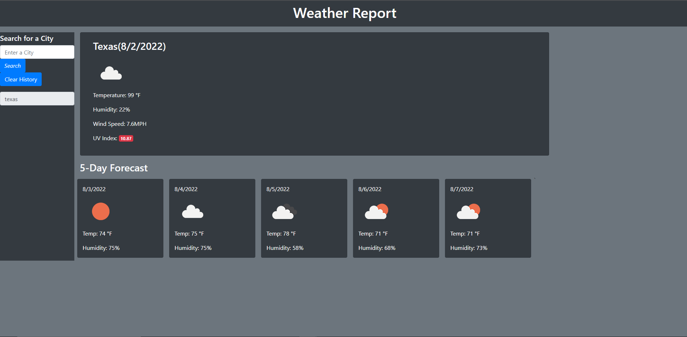

# Weather-App

**URL** https://watssupp.github.io/Weather-App/

## Description
Weather application that allows users t get current / 5 day forcast. Saves previously looked up searches local storage

## Usage
- This weather dashboard allows users to search for a city to get the current weather and 5 day forecast.
- It will display the the city name, the date, an icon representation of weather conditions, the temperature, the humidity, the wind speed, and the UV - index.
-The UV index will be color coded. Whether the conditions are favorable, moderate, or severe.
-With a 5-day forecast that displays the date, an icon representation of weather conditions, the temperature, and the humidity.
-Search history will be saved in local storage.
-This weather daskboard app is mobile compatible.

## Screen Shot
